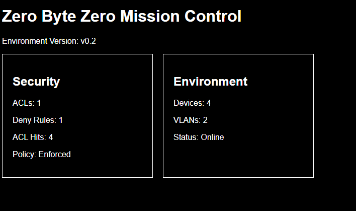

\# Zero Byte Zero Mission Control

\## Project Overview

Zero Byte Zero Mission Control is a security operations dashboard being developed as part of the Zero Byte Zero Enterprise Homelab. 

Mission Control is designed to provide a centralized view of the homelab environment, including network architecture, security controls, assets, validation results, and eventually live security telemetry. 

\## Version 0.1 - Static Dashboard Foundation

Mission Control v0.1 establishes the initial front-end structure for the dashboard using HTML and CSS.

\### Current Features

\- Local browser-based dashboard

\- Environment version tracking

\- Environment status card

\- Security status card

\- Reusable dashboard card styling

\- Two-column CSS Grid layout

\- Data based on the ZBZ Enterprise Security Homelab v0.2 network

\## Development and Validation

Mission Control was built incrementally, with each structural and styling change tested in the browser before continuing development.

During implementation of the two-column card layout, the expected grid behavior did not occur. Inspection of the CSS identified that the `.card-grid` rule had been incorrectly nested inside the `.dashboard-card` rule.

The selectors were separated into independent CSS rules and the page was retested. The Environment and Security cards then rendered successfully in the intended two-column grid layout.

\### Validation Process

1\. Define expected behavior.

2\. Make one controlled change.

3\. Save and refresh the browser.

4\. Compare the observed result with the expected result.

5\. Inspect the HTML or CSS when results differ.

6\. Correct the issue and retest.

7\. Capture evidence after successful validation.

\## Evidence

\### Mission Control v0.1 - Two-Column Grid Layout

\## Roadmap

\- Expand Mission Control with Network, Assets, and Control Validation cards

\- Separate dashboard data from HTML using structured JSON

\- Add JavaScript for dynamic data loading and dashboard interaction

\- Introduce SQLite for persistent homelab data

\- Develop a Python-based data and automation layer

\- Integrate lab telemetry and centralized security monitoring

\- Add dedicated views for labs, evidence, GitHub activity, logs, and deception systems

## Featured Projects

### [VLAN Segmentation, DNS, and ACL Management](projects/vlan-dns-acl-management/README.md)

Built and secured a segmented Cisco Packet Tracer network using VLANs, router-on-a-stick, switch management, internal DNS, and an extended ACL. Diagnosed an overbroad deny rule and replaced it with a least-privilege control that blocked HTTP while preserving DNS, ICMP, and HTTPS connectivity.
