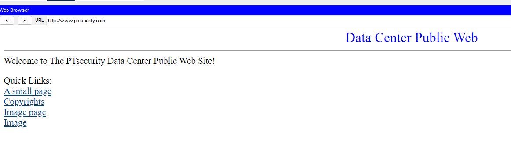
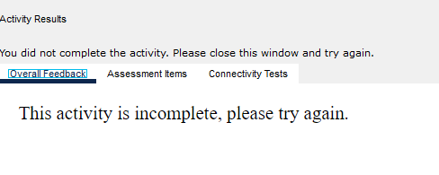
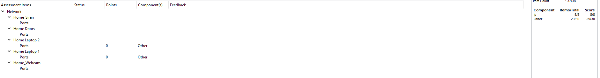

# Wireless Router Hardening & Guest Network Isolation

> A Cisco Packet Tracer security lab focused on wireless hardening,
> trusted/guest segmentation, IoT connectivity, validation, and
> evidence-driven troubleshooting.

## Project Status

**Status:** Complete --- 38/38 validation items\
**Platform:** Cisco Packet Tracer\
**Environment:** Simulated home / small-office wireless network\
**Focus:** Router hardening, WPA2/AES, guest isolation, DHCP, DNS, IoT
security, and connectivity validation

## Overview

This project hardened a partially configured wireless network containing
trusted clients, guest clients, and IoT devices.

The objective was not simply to establish connectivity. The network was
configured so trusted and guest devices could reach external services
while guest clients were prevented from accessing devices on the trusted
local network.

The project followed the Zero Byte Zero workflow:

**Build → Break → Observe → Fix → Verify → Document**

## Security Objectives

-   Replace the router's default administrative password.
-   Disable remote management.
-   Configure a trusted wireless network named `HomeNet`.
-   Protect wireless access with WPA2-Personal and AES.
-   Configure a separate `GuestNet` with independent credentials.
-   Secure IoT devices with WPA2-PSK.
-   Obtain client addressing through DHCP.
-   Verify DNS and external web connectivity.
-   Demonstrate GuestNet-to-HomeNet access before isolation.
-   Enforce guest isolation.
-   Re-test the same path and confirm that access is blocked.
-   Validate the final configuration against all graded security
    requirements.

## Network Components

  -----------------------------------------------------------------------
  Component                           Role
  ----------------------------------- -----------------------------------
  Home Wireless Router                Wireless access, DHCP,
                                      trusted/guest network policy

  Home Office PC                      Router administration

  Home Laptop 1                       Trusted `HomeNet` wireless client

  Home Laptop 2                       `GuestNet` wireless client

  Home_Webcam                         Trusted IoT client

  Home_Siren                          Trusted IoT client

  Home Doors                          Trusted IoT client

  DNS Server                          Name resolution at `10.2.0.125`

  Public Web Server                   External validation target,
                                      `www.ptsecurity.com` / `10.0.0.3`
  -----------------------------------------------------------------------

## Security Configuration

### Router Hardening

The default router administrative credentials were replaced and remote
management was disabled to reduce unnecessary administrative exposure.

### Trusted Wireless Network --- HomeNet

All three wireless radios were configured to broadcast the same trusted
SSID:

-   **SSID:** `HomeNet`
-   **Security:** WPA2-Personal
-   **Encryption:** AES
-   **Passphrase:** redacted from portfolio documentation

### Guest Wireless Network --- GuestNet

A separate guest profile was configured across all three radios:

-   **SSID:** `GuestNet`
-   **Security:** WPA2-Personal
-   **Encryption:** AES
-   **Passphrase:** redacted from portfolio documentation
-   **Local-network access:** disabled during final hardening

### IoT Devices

The webcam, siren, and door system were joined to `HomeNet` using
WPA2-PSK and DHCP.

## Validation

### External Connectivity

Both trusted and guest wireless clients successfully reached the
simulated public web service at `www.ptsecurity.com`.




### Baseline --- Guest Access Before Isolation

Before guest isolation was enabled, the GuestNet laptop could
communicate directly with the HomeNet laptop.

``` text
Home Laptop 2 (GuestNet) → Home Laptop 1 (HomeNet)
Packets: Sent = 4, Received = 4, Lost = 0
Packet loss: 0%
```


This established the known-good baseline and demonstrated the security
exposure that needed to be corrected.

### Control Enforcement --- Guest Isolation

The router was then configured to prevent guest clients from seeing one
another or accessing the local trusted network.

The GuestNet client was reconnected so the updated policy would take
effect, and the identical connectivity test was repeated.

``` text
Home Laptop 2 (GuestNet) → Home Laptop 1 (HomeNet)
Packets: Sent = 4, Received = 0, Lost = 4
Packet loss: 100%
```


The failed ping was the expected security result: GuestNet retained
external connectivity while direct access to HomeNet was blocked.

## Troubleshooting Case Study

### Symptom 1 --- External Website Initially Failed

The trusted laptop initially failed to load `www.ptsecurity.com`.

Instead of changing working wireless settings, connectivity was tested
progressively:

``` text
Client → Default Gateway        PASS
Client → DNS Server             PASS after convergence
DNS name resolution            PASS
Client → Public Server          PASS after convergence
Browser → Public Web Service    PASS
```

The DNS server at `10.2.0.125` was reachable, and `www.ptsecurity.com`
resolved to `10.0.0.3`. Packet loss decreased as the simulated
environment converged, after which the public web page loaded
successfully.

This isolated the temporary failure from the WPA2/HomeNet configuration
and prevented unnecessary changes to a working control.

### Symptom 2 --- Guest Isolation Did Not Immediately Apply

After local-network access was disabled for GuestNet, the existing guest
session initially continued to reach the trusted laptop.

The guest wireless client was reconnected, then the same ping test was
repeated. The result changed from 0% packet loss to 100% packet loss,
confirming that the isolation policy was being enforced.

### Symptom 3 --- Final Validation Reported 37/38

Functional testing passed, but Packet Tracer still reported the activity
as incomplete.



Assessment review showed **37 of 38** items complete.



A final configuration review found that **Remote Management was
enabled**. It was disabled and the configuration was saved.

The next validation returned full completion:


### Key Finding

**Functional connectivity does not prove secure configuration.**

The network could browse the web, resolve DNS, and enforce guest
segmentation while still containing an unnecessary administrative
exposure. Independent control verification identified the remaining
hardening issue.

## Validation Chain

``` text
Router credentials hardened
          ↓
HomeNet + WPA2/AES configured
          ↓
GuestNet + WPA2/AES configured
          ↓
IoT clients securely connected
          ↓
Trusted + guest Internet access verified
          ↓
Guest → Home baseline: 4/4 PASS
          ↓
Guest isolation enabled
          ↓
Guest → Home validation: 0/4 EXPECTED DENY
          ↓
Assessment: 37/38
          ↓
Remote Management reviewed and disabled
          ↓
Final assessment: 38/38 COMPLETE
```

## Skills Demonstrated

-   Cisco Packet Tracer
-   Wireless network configuration
-   WPA2-Personal / WPA2-PSK
-   AES encryption
-   Router hardening
-   Administrative exposure reduction
-   Trusted and guest network segmentation
-   Guest network isolation
-   IoT wireless security
-   DHCP
-   DNS troubleshooting
-   ICMP connectivity testing
-   Baseline and post-control validation
-   Evidence-driven troubleshooting
-   Security control verification
-   Technical documentation

## Lessons Learned

**Connectivity and security are separate questions.** A network can
function correctly while still exposing an unnecessary administrative
service.

**Test from known-good points outward.** Verifying the gateway, DNS
server, name resolution, and destination separately made it possible to
locate the failing layer without dismantling working configuration.

**Use identical before-and-after tests.** The same GuestNet-to-HomeNet
ping demonstrated both the original exposure and the effect of the
isolation control.

**A failed ping can be a successful security test.** After guest
isolation, 100% packet loss was the intended result.

**Re-authentication can matter after policy changes.** Reconnecting the
guest wireless client caused the new isolation policy to take effect.

**Final verification matters.** The 37/38 result exposed a remaining
router-hardening issue that functional tests alone did not reveal.

## Portfolio Summary

Hardened a simulated wireless network in Cisco Packet Tracer by
replacing default administrative credentials, disabling remote
management, implementing WPA2/AES security, separating trusted and guest
wireless access, and securely onboarding IoT devices. Validated DHCP,
DNS, and external connectivity, then demonstrated guest-network
isolation using identical before-and-after ICMP tests. Troubleshot
convergence and session-state behavior without disrupting known-good
controls. Final assessment initially reported 37/38 requirements;
configuration review identified remote management as the remaining
exposure, which was remediated and verified at 38/38 completion.

------------------------------------------------------------------------

**Project:** Zero Byte Zero --- Wireless Router Hardening & Guest
Network Isolation\
**Method:** Build → Break → Observe → Fix → Verify → Document
